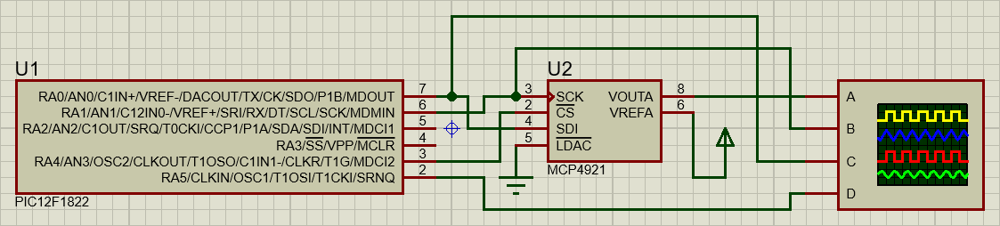

# Fast Sine Wave Generation with PIC microcontroller

This project is part of a college subject and demonstrates how to generate a sine wave with a 12-bit DAC as fast as possible using the PIC12F1822 microcontroller and the DAC MCP4921. 

The goal of the project is to optimize the code to generate the sine wave with the highest possible frequency, while maintaining a resolution of 1 degree.

## Function to Generate

The function to generate is:
$$y = 1.5 + |3.5 * \sin(\omega t)|$$

## Screenshot

## Options Considered

The following options were considered for generating the sine wave:

- **List of pre-built values of sine:** This option involves pre-computing a list of sine values and storing them in memory.

- **Using the sine function:** Another option is to use the built-in sine function provided by the C_Math library of MikroC PRO for PIC. The sine function calculates the value of sine for a given angle on the fly, which means that it takes more processing time to generate the sine wave than the pre-built values option.

- **List of pre-built DAC values:** This option involves pre-computing a list of DAC values to generate the function and storing them in memory.

## Results

After testing and optimization, the highest frequency achieved was 256.41Hz. This was achieved by using a pre-built list of DAC values.

The following table shows the results of the different options:

| Option | Frequency (Hz) |
| :---- | ----: |
| Pre-built list of DAC values | 256.41 |
| Pre-built list of sine values | 68.77 |
| Using the sine function | 4.74 |

While the use of a pre-built list of values may not be appropriate for all applications, it was an effective technique for achieving high-frequency sine wave generation with 1 degree resolution with the PIC12F1822 microcontroller and the DAC MCP4921.

## Getting Started

To get started, simply download the repository and open the code in MikroC Pro. Follow the instructions in the code comments to modify the code or adjust the hardware setup as needed.

## Dependencies

- MikroC Pro for PIC v4.0 or later
- PIC12F1822 microcontroller
- DAC MCP4921

## License

This project is licensed under the [MIT License](LICENSE).